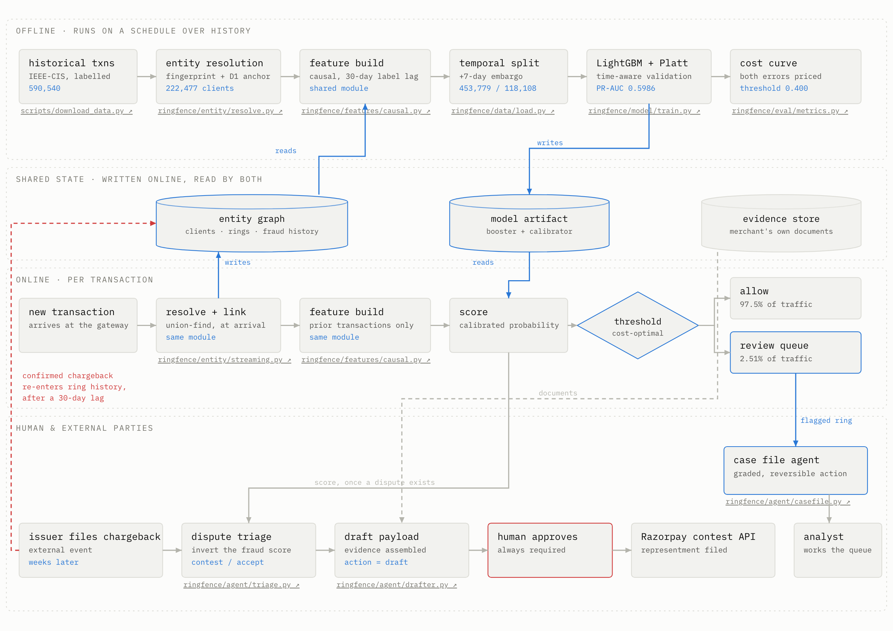

# Ringfence

**Abuse-ring detection and chargeback dispute drafting for card-not-present fraud.**

Built for the Razorpay AI Buildathon, Track 02 — AI Risk Manager.

**📊 [Live results report →](https://hiteshkrgupta.github.io/projects/ringfence/)**
Held-out metrics, an interactive cost-optimal threshold, the leakage ablation, and
the ring review queue with generated case files. Every number on it is regenerated
from `reports/` by `scripts/build_site.py`.

> **Defense-only.** This repository detects and responds to fraud. It contains no
> offense-capable code: no synthetic-identity generation, no evasion testing, no
> carding utilities. See [Scope and safety](#scope-and-safety).

## The problem

A merchant does not lose money to fraudsters one at a time. They lose it to
*rings*: one operator running many cards through a handful of shared addresses,
email domains and devices. Score transactions in isolation and you catch the
tail of a ring after it has already cost you. Score the ring and you can stop
the rest of it.

Then the chargebacks arrive anyway for what got through — and contesting them is
manual, deadline-bound work that most merchants simply eat.

Ringfence does both halves:

1. **Detect** — resolve transactions into client entities, link clients into
   rings by shared attributes, and score at the ring level.
2. **Respond** — for disputes that do land, draft a Razorpay
   [contest-a-dispute](https://razorpay.com/docs/api/disputes/contest/) payload
   with the evidence bundle assembled and a written summary.

## Architecture



Two execution planes. Training runs on a schedule over history; scoring runs per
transaction the moment it arrives. They share one entity graph, one model
artifact, and — critically — the **same feature module**, which is what makes the
offline metrics predictive of online behaviour.

The red path is the feedback loop: a confirmed chargeback re-enters the ring's
fraud history, but only after the reporting lag. That delay is why the feature
can be used honestly. The dispute branch is triggered by the issuer, not by the
model, and terminates at a human.

Every node in the [interactive version](https://hiteshkrgupta.github.io/projects/ringfence/)
links to the file that implements it.

## Why the numbers here can be believed

Fraud results are easy to fake by accident. Four deliberate choices:

- **Real labels.** [IEEE-CIS](https://www.kaggle.com/competitions/ieee-fraud-detection/data)
  (590,540 real card-not-present transactions, 3.5% fraud rate). Its ground truth
  *is* reported chargebacks — the exact loss class this track is about.
- **Temporal split with an embargo.** Never random. A random split scatters one
  ring across both sides of the boundary and lets the model memorise it. We also
  drop 7 days adjacent to the cutoff, because at scoring time the most recent
  labels do not yet exist.
- **Causal ring membership, and a 30-day label lag.** A transaction's ring is
  decided by replaying history in time order, so a *later* transaction can never
  determine which ring an earlier one belongs to. And "prior frauds in this ring"
  only counts frauds that would already have been *reported* — a chargeback is
  not known when it happens.
- **Cost-weighted metrics, not AUC-ROC.** At 3.5% prevalence AUC-ROC is
  dominated by the majority class and hides false-positive cost. We report
  PR-AUC, precision@k at realistic review capacity, recall at a fixed FP budget,
  and a rupee cost curve that *selects* the threshold.

## Results

On **118,108 held-out transactions**, from a period strictly later than all training data:

| | With rings | Without | Change |
|---|---:|---:|---:|
| PR-AUC | **0.5986** | 0.5027 | +19.1% |
| Recall @ 0.5% FP budget | 0.456 | 0.362 | +26.0% |
| precision@100 | 0.980 | 1.000 | −2.0% |
| Money saved | **₹18,476,797** | ₹12,835,072 | **+44.0%** |

Against a ₹59,770,222 baseline loss, the cost-optimal setting recovers **30.9%**
while flagging 2.51% of traffic. The ring layer is worth ₹5.6M of that.

### What the honesty costs

Claiming a leakage boundary is worth nothing unless the gap is measured. Each
guarantee was broken in turn, changing nothing else:

| Variant | Assumes | PR-AUC | ₹ saved |
|---|---|---:|---:|
| **honest** | causal features, 30-day lag *(shipped)* | **0.5986** | **18,476,797** |
| `lag0` | chargebacks known instantly | 0.9691 | 52,814,554 |
| `whole_frame` | ring stats over the whole dataset | 0.9612 | 52,264,200 |

Either shortcut lifts PR-AUC from 0.60 to ~0.96 and **nearly triples the money**.
Those rows are not results — they are the size of the overstatement avoided.

### The dispute agent

Given a chargeback, it decides whether the case is worth fighting and drafts the
Razorpay payload. There is no public data on dispute *outcomes*, so rather than
invent labels it **inverts the detector**: once a chargeback is filed, a low
fraud score means the transaction looked legitimate on every signal yet is being
disputed — the friendly-fraud signature. A high score means the card really was
stolen, and the system refuses to contest a genuine victim's claim.

Both agents run on `google/gemini-3.7-flash` via OpenRouter, chosen across the
332 models offering schema-constrained output. A generated analyst case file
costs a measured **₹0.13**.

See [ARCHITECTURE.md](ARCHITECTURE.md) for the full design, the leakage
boundary, and an honest limitations section.

## Quickstart

```bash
uv venv --python 3.11 && uv pip install -e .
pytest                                    # 57 tests, no data needed

ringfence data download                   # needs Kaggle credentials in .env
ringfence data prepare --tag main         # ~90s
ringfence train --tag main                # ~35s
ringfence status                          # what is built
```

Reproduce the two ablations:

```bash
ringfence train --tag noring --data-tag main --no-ring-features
ringfence ablate --force                  # ~6 min; omit --force to read cached
```

The agent layer runs against real rings from the held-out set:

```bash
ringfence agent --offline                 # no API key needed
ringfence agent                           # needs OPENROUTER_API_KEY in .env
```

Every command wraps a script in `scripts/`, which stay runnable directly —
that is how the numbers above were produced.

## Results page

The report lives in [`docs/`](docs/) and is published at
**<https://hiteshkrgupta.github.io/projects/ringfence/>**.

```bash
ringfence site                            # rebuild docs/ from reports/
ringfence site --mirror ../some/other/repo   # and publish it elsewhere
python -m http.server --directory docs    # preview at localhost:8000
```

Nothing on that page is hand-written or simulated. `scripts/build_site.py`
regenerates `docs/data.json` from `reports/` and `scripts/make_architecture.py`
regenerates the architecture diagram from code, so the page cannot drift from
the experiment that produced it.

## Scope and safety

The Buildathon brief for this track states: *"Strictly defense-only: anything
offense-capable is disqualified."* This project takes that seriously.

- All data is the public IEEE-CIS research dataset. No real cardholder data.
- The model scores risk and explains itself. It does not generate identities,
  probe defences, or test evasion.
- The dispute agent drafts evidence for a *merchant contesting a chargeback* —
  it never fabricates evidence, and it is wired to `action: "draft"`, never
  `"submit"`, so a human always signs off.

## License

MIT — see [LICENSE](LICENSE).
